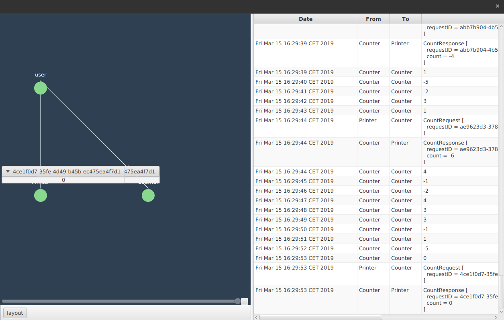

# Muse
A way to visualize and debug the execution of an Akka ActorSystem 

## Screenshot


## What is it?
Muse is a tool to visualize the execution of an Akka ActorSystem, which means that you can graphically see your actors and the messages they exchange between one another. 
The purpose of the tool is to make it easier to develop, learn, debug and monitor akka applications.

First, you need to configure your application to use Muse inboxes instead of the standard inboxes. 
Then, on application startup, you connect to a Muse server (or spawn one locally) and your application will start sending the server information about the nodes and messages. 
You can then connect to your application using a client to see your nodes and messages.
You can also scroll through time to see what your application was doing a while ago and generate sequence diagrams. By default the server keeps this in memory, but you can also persist your messages in kafka. This way, you could potentially save a week worth of messages, which will help in debugging.

## Usage
First, make sure you application.conf looks something like this. As you can see, we're configuring both Akka remote and Muse.
```
akka {
  actor {
    provider = remote
    default-mailbox.mailbox-type = "com.sirolf2009.muse.inbox.MuseInbox"
    mailbox.requirements {
      "com.sirolf2009.muse.inbox.MyMailboxSemantics" = muse-mailbox
    }
  }
  remote {
    enabled-transports = ["akka.remote.netty.tcp"]
    netty.tcp {
      hostname = "127.0.0.1"
      port = 2553
    }
 }
}


muse-dispatcher {
  mailbox-requirement =
  "com.sirolf2009.muse.inbox.MyMailboxSemantics"
}

muse-mailbox {
  mailbox-type = "com.sirolf2009.muse.inbox.MuseInbox"
}
```
Next, connect the actorsystem to the server. Do this before you start spawning actors and sending messages around, or you may lose some messages in Muse.
```java
ActorSystem system = ActorSystem.create("MuseExampleApp");
MuseConnect.connect(system); //Connects to localhost:2552
		
ActorRef printer = system.actorOf(Props.create(Printer.class), "Printer");
ActorRef counter = system.actorOf(Props.create(Counter.class), "Counter");
```
